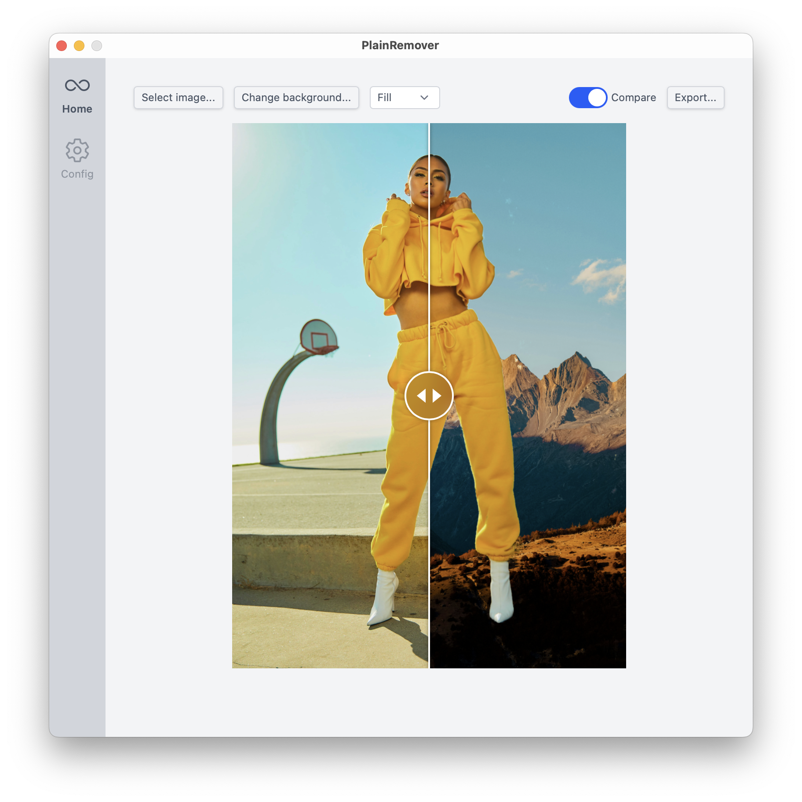

PlainRemover
============

> Plain image background remover

## Features

- [x] **AI-Powered Background Removal**: Uses advanced machine learning models to accurately detect and remove backgrounds.
- [x] **Custom ONNX Models**: Bring your own models to fit your need.
- [x] **User-Friendly Interface**: Easy-to-use UI for non-technical users.
- [x] **Cross-Platform Support**: Works on Windows, macOS, and Linux.
- [x] **Custom Background Replacement**: Replace the removed background with a solid color or another image.
- [ ] **Batch Processing**: Process multiple images at once.

## Installation

Download page: https://github.com/plainlab/plainremover/releases/latest

- macOS: Get `.dmg` file, open it and drag the app into Applications folder, for Apple
  Silicon mac: get `aarch64.dmg` file instead.
- Windows: Get `.exe` file and open it to install.
- Linux: Get `.AppImage` file to install.

## Screenshot

## Custom models

Model list

- u2net ([download](https://github.com/danielgatis/rembg/releases/download/v0.0.0/u2net.onnx), [source](https://github.com/xuebinqin/U-2-Net)): A pre-trained model for general use cases.
- u2netp ([download](https://github.com/danielgatis/rembg/releases/download/v0.0.0/u2netp.onnx), [source](https://github.com/xuebinqin/U-2-Net)): A lightweight version of u2net model.
- u2net_human_seg ([download](https://github.com/danielgatis/rembg/releases/download/v0.0.0/u2net_human_seg.onnx), [source](https://github.com/xuebinqin/U-2-Net)): A pre-trained model for human segmentation.
- u2net_cloth_seg ([download](https://github.com/danielgatis/rembg/releases/download/v0.0.0/u2net_cloth_seg.onnx), [source](https://github.com/levindabhi/cloth-segmentation)): A pre-trained model for Cloths Parsing from human portrait. Here clothes are parsed into 3 category: Upper body, Lower body and Full body.
- silueta ([download](https://github.com/danielgatis/rembg/releases/download/v0.0.0/silueta.onnx), [source](https://github.com/xuebinqin/U-2-Net/issues/295)): Same as u2net but the size is reduced to 43Mb.
- isnet-general-use ([download](https://github.com/danielgatis/rembg/releases/download/v0.0.0/isnet-general-use.onnx), [source](https://github.com/xuebinqin/DIS)): A new pre-trained model for general use cases.
- isnet-anime ([download](https://github.com/danielgatis/rembg/releases/download/v0.0.0/isnet-anime.onnx), [source](https://github.com/SkyTNT/anime-segmentation)): A high-accuracy segmentation for anime character.
- sam ([download encoder](https://github.com/danielgatis/rembg/releases/download/v0.0.0/vit_b-encoder-quant.onnx), [download decoder](https://github.com/danielgatis/rembg/releases/download/v0.0.0/vit_b-decoder-quant.onnx), [source](https://github.com/facebookresearch/segment-anything)): A pre-trained model for any use cases.
- birefnet-general ([download](https://github.com/danielgatis/rembg/releases/download/v0.0.0/BiRefNet-general-epoch_244.onnx), [source](https://github.com/ZhengPeng7/BiRefNet)): A pre-trained model for general use cases.
- birefnet-general-lite ([download](https://github.com/danielgatis/rembg/releases/download/v0.0.0/BiRefNet-general-bb_swin_v1_tiny-epoch_232.onnx), [source](https://github.com/ZhengPeng7/BiRefNet)): A light pre-trained model for general use cases.
- birefnet-portrait ([download](https://github.com/danielgatis/rembg/releases/download/v0.0.0/BiRefNet-portrait-epoch_150.onnx), [source](https://github.com/ZhengPeng7/BiRefNet)): A pre-trained model for human portraits.
- birefnet-dis ([download](https://github.com/danielgatis/rembg/releases/download/v0.0.0/BiRefNet-DIS-epoch_590.onnx), [source](https://github.com/ZhengPeng7/BiRefNet)): A pre-trained model for dichotomous image segmentation (DIS).
- birefnet-hrsod ([download](https://github.com/danielgatis/rembg/releases/download/v0.0.0/BiRefNet-HRSOD_DHU-epoch_115.onnx), [source](https://github.com/ZhengPeng7/BiRefNet)): A pre-trained model for high-resolution salient object detection (HRSOD).
- birefnet-cod ([download](https://github.com/danielgatis/rembg/releases/download/v0.0.0/BiRefNet-COD-epoch_125.onnx), [source](https://github.com/ZhengPeng7/BiRefNet)): A pre-trained model for concealed object detection (COD).
- birefnet-massive ([download](https://github.com/danielgatis/rembg/releases/download/v0.0.0/BiRefNet-massive-TR_DIS5K_TR_TEs-epoch_420.onnx), [source](https://github.com/ZhengPeng7/BiRefNet)): A pre-trained model with massive dataset.

Credit: https://github.com/danielgatis/rembg

---

&copy; 2025 Tai Vo
